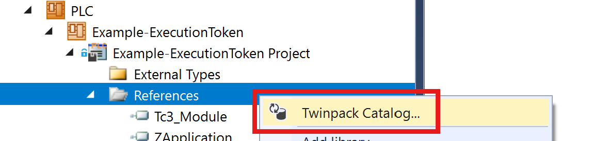
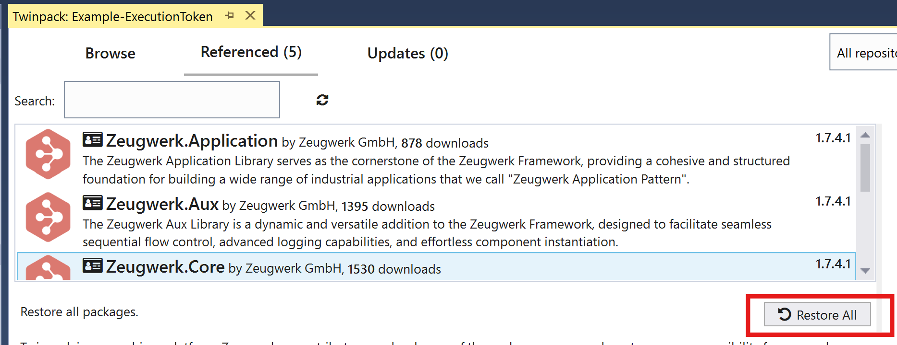
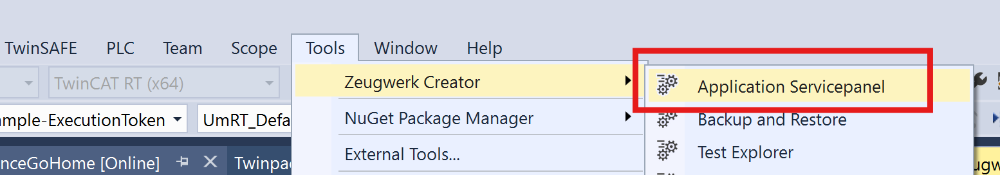
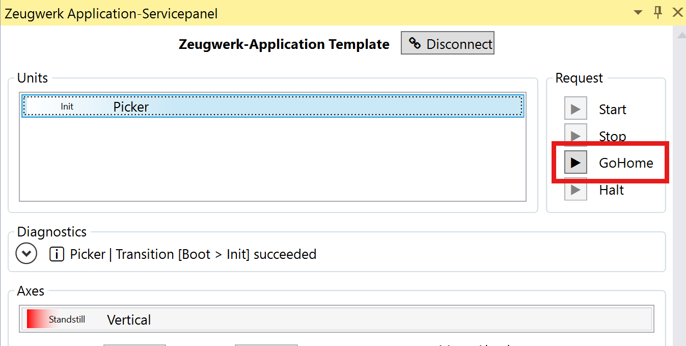

# Example Zeugwerk Framework - ExecutionToken

This is an example of how to use different types of IStartToken objects as a parameter calling "Async" methods. You may get an idea of the possibilities to take care of a successful execution of an "Async" function but also how to monitor the whole execution of the async task.

## Looking at the code

The example is a Zeugwerk Application with a unit Picker. The units equipment includes an axis "Vertical".
In the homing sequence of the unit we move the axis to position 30, change the target position to 60 after two seconds and stop the axis after another two seconds.

The user can find the sequence under **ZApp/Unit/Picker/_States/PickerSequenceGoHome**
By changing the value of the variable **_tokenUsage** in the sequence, you can use different objects as the IStartToken parameter for the "Async" method calls.
  
Read the comments about what changes with the different IStartToken objects or run the example to see the difference.

## Running the example

- First, install the Zeugwerk Development Kit and activate your trial license:

Get the installer from [https://github.com/Zeugwerk/Zeugwerk-Development-Kit/releases/latest](https://github.com/Zeugwerk/Zeugwerk-Development-Kit/releases/latest)

- Then open the Solution Example-ExecutionToken with TcXAEShell

Right click on the References node, open the Twinpack Catalog and restore all referenced libraries.
  


  
- Download and start the plc on a test target (e.g. Usermode Runtime)
  
Open the Zeugwerk Creator Service Panel and start the Homing sequence of the Picker unit
  



- Open the log file of the Zeugwerk Application located at

```
C:\Zeugwerk\logs\messages.log
```

You should see log output indicating the activity of the sequence:

```
TRC |03-09|18:11:27.539|Picker | AxisSimulated |Vertical | MoveAbsolute sequence finished
TRC |03-09|18:11:27.549|Picker | AxisSimulated |Vertical | Statemachine | Transition [MoveAbsolute > Idle] succeeded
TRC |03-09|18:11:27.549|Picker | GoHome step changed to GoHomeMoveAxisTo60
TRC |03-09|18:11:27.559|Picker | AxisSimulated |Vertical | Statemachine | Transition [Idle > MoveAbsolute] succeeded
TRC |03-09|18:11:27.569|Picker | AxisSimulated |Vertical | MoveAbsolute sequence started
TRC |03-09|18:11:27.569|Picker | AxisSimulated |Vertical | MoveAbsolute : MoveAbsoluteAsync from: -0.0001 to: 30.0000 speed: 10.0000
TRC |03-09|18:11:27.569|Picker | AxisSimulated |Vertical | MoveAbsolute step changed to MoveAbsoluteBegin
TRC |03-09|18:11:27.580|Picker | AxisSimulated |Vertical | MoveAbsolute step changed to MoveAbsoluteMove
TRC |03-09|18:11:29.603|Picker | AxisSimulated |Vertical | MoveAbsolute step changed to MoveAbsoluteBegin
TRC |03-09|18:11:29.613|Picker | AxisSimulated |Vertical | MoveAbsolute step changed to MoveAbsoluteMove
TRC |03-09|18:11:33.792|Picker | AxisSimulated |Vertical | MoveAbsolute step changed to MoveAbsoluteEnd
TRC |03-09|18:11:33.792|Picker | AxisSimulated |Vertical | MoveAbsolute sequence finished
TRC |03-09|18:11:33.802|Picker | AxisSimulated |Vertical | Statemachine | Transition [MoveAbsolute > Idle] succeeded
TRC |03-09|18:11:33.802|Picker | GoHome step changed to GoHomeMoveAxisBackTo0
TRC |03-09|18:11:33.812|Picker | AxisSimulated |Vertical | Statemachine | Transition [Idle > MoveAbsolute] succeeded
TRC |03-09|18:11:33.822|Picker | AxisSimulated |Vertical | MoveAbsolute sequence started
TRC |03-09|18:11:33.822|Picker | AxisSimulated |Vertical | MoveAbsolute : MoveAbsoluteAsync from: 59.9992 to: 0.0000 speed: 10.0000
TRC |03-09|18:11:33.822|Picker | AxisSimulated |Vertical | MoveAbsolute step changed to MoveAbsoluteBegin

```

- Repeat the homing sequence with different **_tokenUsage** settings and therefore different IStartToken objects to see the different behavior of the objects.


## Questions?

Reach out at [info@zeugwerk.at](mailto:info@zeugwerk.at) if you have any questions or concerns!